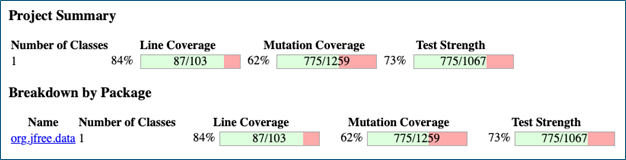
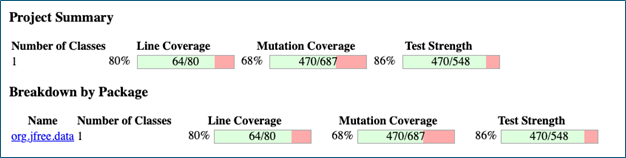
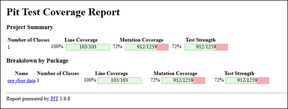
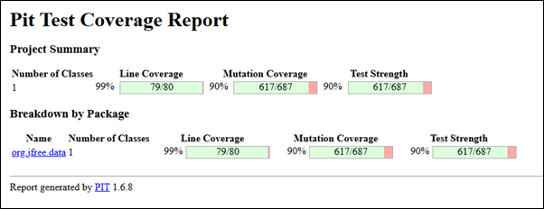
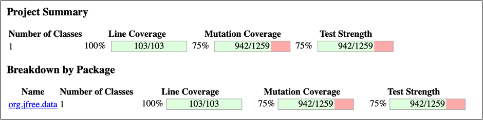
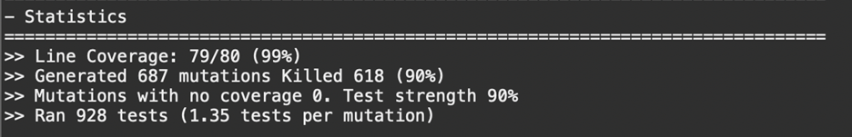
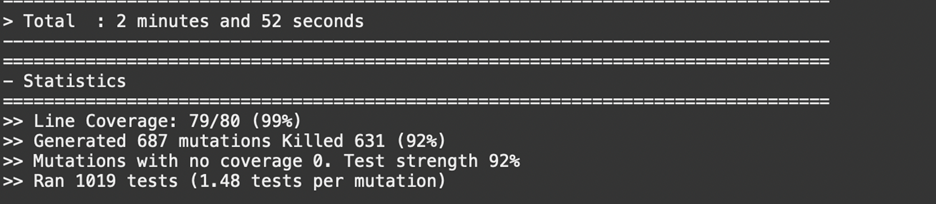
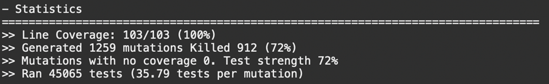
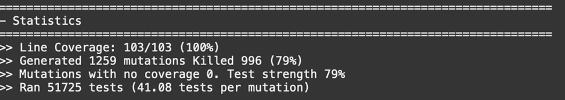
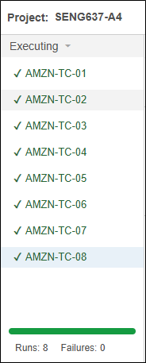

**SENG 637 - Dependability and Reliability of Software Systems**

**Lab. Report \#4 – Mutation Testing and Web app testing**

| Group \#: 12     |
| ---------------- |
| Student Names:   |
| Jason Chiu       |
| William Watson   |
| Jack Shenfield   |
| Barrett Sapunjis |

# 1. Introduction
The focus of this lab to familiarize ourselves with two new types of testing: mutation testing and GUI testing. Mutation testing is implemented using the JUnit testing framework along with the eclipse IDE and Pitest eclipse extension. The testing is completed on provided, previous assignment versions, and current assignment updated versions of the testing suites and gives insight to their efficacy at these different levels. 

The GUI testing is completed with selenium IDE on Chrome and Firefox and  tested on Amazon.ca as the system under test. Selenium is used to record and extract user actions in order to replicate them during test along with manually injected intermediate asserts and checks automatically evaluated when tests are run. It is noted that working testing scripts often fail due to differences in the testing OS and versioning of the web browsers. Sikulix was also used for exploration and prototyping of GUI testing to compare it to selenium. It tends to be a bit more transferable and maintainable but has its own issues and a lot of upfront cost. 

# 2. Analysis of 10 Mutants of the Range class 
1. The first mutant modified the constructor’s boundary condition so that cases where the lower and upper bounds are equal would be treated as invalid. This mutant was successfully killed because the test suite includes scenarios that rely on valid zero-length ranges. These tests fail immediately if such ranges are incorrectly rejected.

2. The second mutant negated the constructor’s conditional logic, effectively reversing the validity of range inputs. This was also killed, as many tests depend on constructing valid range objects. When normal construction fails, a large portion of the test suite breaks, making this mutation easy to detect.

3. The third mutant removed the creation of an exception when the lower bound exceeds the upper bound. This was caught by the test suite because there is a specific test that expects an IllegalArgumentException to be thrown in this situation. Without exception, the test fails.

4. The fourth mutant altered the null-check logic in the combine() method by negating the condition that checks if the first range is null. This mutation was detected because the test suite includes cases where one or both input ranges are null, and the incorrect logic produces invalid results.

5. The fifth mutant removed the use of the minimum function when computing the lower bound in the combine() method. This was killed because several tests verify the exact lower bound of the resulting range. Any deviation from the correct minimum value causes these tests to fail.

6. The sixth mutant removed the use of the maximum function when computing the upper bound in the combine() method. Similar to the previous case, this was detected because the test suite checks the exact upper bound, and incorrect values lead to test failures.

7. The seventh mutant changed the boundary condition in the constrain() method for values above the upper limit. This mutant survived because the test suite does not include a case where the input value is exactly equal to the upper bound. As a result, incorrect handling of this specific boundary is not detected.

8. The eighth mutant modified the boundary condition in the constrain() method for values below the lower limit. This also survived, as there are no tests that check behavior when the value is exactly equal to the lower bound. The existing tests only cover values strictly inside or outside the range.

9. The ninth mutant altered the condition in the expandToInclude() method for values below the lower bound. This mutation was not detected because the test suite does not include a case where the value is exactly equal to the lower bound, leaving this edge case untested.

10. The tenth mutant changed the condition in the expandToInclude() method for values above the upper bound. Like the previous cases, this survived due to the absence of tests covering the exact upper boundary. Without these edge cases, the incorrect behavior is not exposed.

It is worth noting that the identified mutants correspond to common mutation operator categories used by Pitest, including conditional boundary mutations, negated conditionals, and arithmetic operator replacements. Understanding the specific mutation operator applied in each case helps explain why certain mutants are more easily killed (e.g., large behavioral changes) while others, particularly boundary-related mutations, require more precise and targeted test cases.

# 3 Statistics and the Mutation Score for each Test Class 

**Figure 1:** Pitest Results for Range Class with Provided Test Suite 

**Figure 2:** Pitest Results for  DataUtilities Class for Provided Test Suite

**Figure 3:** Pitest Results for Range Class with Custom Test Suite (from assignment 3)

**Figure 4:** Pitest Results for DataUtilities class with Custom Test Suite (from assignment 3)

# 4. Analysis of the Effectiveness of each of the Test Classes
The RangeTest class achieves 100% line coverage (103/103), confirming that every line of the Range class is executed during testing. Despite this, the mutation score is 72% (912/1259), indicating that a notable portion of injected faults are not detected by the test suite. This demonstrates that while all code paths are exercised, the tests do not fully capture incorrect behaviors introduced by mutations, limiting overall fault detection effectiveness.

The second test class achieves 99% line coverage (79/80) and a mutation score of 90% (617/687). Although one line of code is not executed, the test suite demonstrates strong fault detection capability. The high mutation score indicates that most injected faults are successfully identified, suggesting that the tests are effective at validating behavior and detecting errors.

Both test classes provide high levels of code coverage and ensure that nearly all code is executed during testing. However, they differ in their effectiveness at detecting faults. The RangeTest class ensures complete execution of all lines but identifies fewer faults, while the second test class achieves stronger fault detection with slightly less coverage.

Overall, the second test class demonstrates greater effectiveness in identifying faults, while the RangeTest class highlights that complete line coverage alone does not ensure a robust or comprehensive test suite.

# 5. Discussion on the effect of equivalent mutants on mutation score accuracy 

Equivalent mutants are survivors that have no practical effect on the quality of the tests. As it turns out, these are difficult to locate with certainty, and even more difficult to kill. Qualitatively, there are some patterns that can be detected from looking at the logs of the surviving mutants.

The most common pattern for potential equivalence is incrementing or decrementing a variable in a return statement. There are a few sub cases here worth discussing:
1.	Post incrementing/decrementing variables in a return statement. This seems to be impossible to catch because the increment happens after the value is returned, so it has no effect on the return value. This accounted for a very large number of surviving mutants.
2.	decrementing the left value of a “less than” operator or incrementing the right side of a “greater than operator”. These are functionally the same and do not affect the code. However, to catch them, we can add tests that check the precise output. For example, adding these checks in the intersects method in the Range class killed 5 additional mutants.

Another less common pattern for equivalence is changing the strings in exception messages. These do not change the function of the code, and our tests generally do not check the exact string message. In the range constructor, adding an assertEquals test that checks for the exact error message was able to catch two additional mutants.
Before implementing the additional tests discussed above, the figure 3 from a previous section showed 72% mutation coverage. After implementing the additional tests discussed above, the coverage increases slightly to 75% as seen in the figure below.

**Figure 5:** Pitest Results for Range class on the Improved Test Suite

In terms of automating the detection of equivalent mutants, one possible approach would be to execute the original program and the mutated program across a large and diverse input space and compare their outputs. If no observable differences are detected across all tested inputs, the mutant could be flagged as potentially equivalent. However, this approach relies on the assumption that the selected input space is sufficiently comprehensive, which is difficult to guarantee in practice. As such, while automation can help identify candidates for equivalent mutants, manual inspection is still required for confirmation.

The lesson here is that equivalent mutants are very difficult to kill, and it is often not worth the effort to write additional tests for this purpose. This is one of the flaws of mutation testing.

# 6. Improving Mutation Scores

## DataUtilities
An initial mutation test was completed on DataUtilitiesTest developed for assignment 3. To run it, a few small changes had to be made to produce a passing test suite. The initial results, which can be seen in Figure 6, are a 90% mutation kill rate as well as 99%-line coverage. According to the requirements of this lab, a 100% mutation kill rate is desired.

**Figure 6:** Initial DataUtilities mutation test results

To improve the mutation kill rate, we decided to both modify existing tests and add new special case tests.
We modified testCreateNumberArraySingleValue() and testCreateNumberArrayMultipleValues() so that they no longer checked only the output length; they now also verify the actual numeric contents of the returned Number[]. We also modified testCloneValidArray() by adding an alias check. This was important because mutation testing showed that simple structural assertions were not enough to kill mutants affecting copied values or aliasing behavior.

In addition, we added new white-box tests for edge cases in DataUtilities. For equal(double[][], double[][]), we added tests testEqualBothContainNullRow(), testEqualOneContainsNullRow(), and testEqualNaNValues(). I also added new tests for the filtered overloads calculateColumnTotal(data, column, validRows) and calculateRowTotal(data, row, validCols). These included cases with empty selection arrays, duplicate selected indices, and mixed valid selections. These new tests were designed directly from the surviving PIT mutants.

The mutation score increased, but only to 92% (as can be seen in Figure 7 below) rather than all the way to 100%. This suggests that the additional tests were effective, but some surviving mutants remain difficult to kill. Based on the surviving mutation patterns, many of the remaining mutants are tied to loop increments and boundary comparisons. Some of these are likely still killable with even more targeted tests. However, others may be equivalent mutants, discussed at length in the section prior. Because of that, it seems the law of diminishing returns is in effect here, and it would take a massive effort (out of scope for this lab) to reach near 100%.

**Figure 7:** Final DataUtilities mutation test results

## Range

An initial mutation test was completed on RangeTest developed for assignment 3. Similar to DataUtilities, to run it a few small changes had to be made to produce a green test suite. The initial results, which can be seen in Figure 8, are a 72% mutation kill rate as well as 100%-line coverage. According to the requirements of this lab, an 82% mutation kill rate is desired.

**Figure 8:** Initial Range mutation test results

To improve the mutation kill rate for Range, several new tests were added that specifically targeted surviving PIT mutants. These new tests focused on boundary conditions, false branches, null handling, and special-case behavior in the  methods intersects(), equals(), scale(), expand(), and shift(). Tests testIntersectsRangeObjectFalse() and testIntersectsSymmetry() were added to exercise false-path and symmetry behavior for intersects(Range). testHashCodeExactValue() was added to check the exact hash code value. Many of the PIT mutants appeared to be present in the arithmetic of HashCode(). Additionally, testEqualsDifferentLower() and testEqualsNull() were added to strengthen the equals() tests by distinguishing more specific false cases.

Other null-check tests were also introduced for static methods that use parameter validation, including testExpandNullRange(), testScaleNullRange(), and testShiftNullBaseDefaultOverload(). These were designed to target surviving mutants where PIT removed calls to ParamChecks.nullNotPermitted. Finally, several new tests were created for zero-crossing and edge arithmetic behavior in shift() and expand(), such as testShiftNegativeRangePositiveDeltaNoZeroCrossing(), testShiftCrossingZeroClippedBothSides(), testScaleZero(), and testExpandToSinglePoint(). The list of surviving mutation suggested that many remaining weak points were located around boundary comparisons and range transformation logic, thus we created these tests.

The final mutation test completed on RangeTest resulted in 79% of mutations killed, as can be seen in Figure 9 below. Although this is a substantial improvement, it was short of the desired 82%. 12 additional tests increased the score from 72% to 79%. However, after 6 more tests were added the score remained at 79%. These tests were testContainsNaN(), testConstrainNaN(), testIntersectsSameRange(), testIntersectsRangeContainedReverse(), testExpandZeroMargins(), and testShiftNegativeRangeNoCrossingClipsToZero(). As stated, these tests did not increase the mutation kill percentage any further. This suggested that the remaining surviving mutants were either much more difficult to kill or were likely equivalent mutants that do not change the observable behavior of the program. At that point, continuing to add tests seemed out of scope for the lab.

**Figure 9:** Final Range mutation test results

Overall, while the original goal was to increase mutation coverage by 10% for each tests test suite, this was deemed infeasible with the already substantial effort in attempting to do so. Rather, a limitation of mutation testing can be found here where the amount of effort to improve a test suite does not correlate with the resulting effectiveness as seen by the results. Additional testing design methodologies may be employed to improve in this area, but as already mentioned, limiting the scope of this lab was necessary.

# 7. Why do we need mutation testing? Advantages and disadvantages of mutation testing

Mutation testing is useful as it helps evaluate the robustness of a test suite. Instead of purely measuring coverage, the idea is that it creates small changes (mutants) in the code to see if the tests can catch them. If the test fails (mutant is “killed”), that means the test is doing its job correctly. As a result, statements are properly reached, beyond just code, and the state of execution is evaluated based on how it does it rather than just what it does.

An advantage of mutation testing is the fact that it provides a deeper analysis than just code coverage (high coverage doesn’t necessarily mean a test suite is good). It is useful for (and was used in this lab) for identifying gaps in test coverage. The first initial run of mutation testing resulted in a list of mutants that survived, each associated with a certain line of code in the test suite. By observing which lines resulted in the most mutants, it was clear what tests needed to be modified/expanded upon (with a separate test) to improve the test suite the most.

A disadvantage of mutation testing is the high computational cost and time associated with it. It took the team 2 minutes 50 seconds on average to run the mutation testing for Range and DataUtilities, whereas in the previous lab the JUnitTests were seemingly instantaneous. Additionally, as mutation testing often generates a large number of tests, many may be redundant and one may not learn much from such as equivalent mutations. This leads to some test designing that doesn’t contribute to improving the test suite and in turn the software. Scalability is also an issue as when applied to large codebases due to the exponential growth, a large number of generated mutants may occur.

Overall mutation testing is great for strengthening a test suite but must be used strategically due to run time and computational complexity.

# 8. SELENIUM Test Case Design Process

The test case design process for this assignment followed a structured and systematic approach to ensure enough coverage of core functionalities, edge cases, and realistic user interactions within the selected web application (Amazon Canada).

1. Identification of Core Functionalities
The first step involved identifying the primary user-facing functionalities of the system which for Amazon, included the following considerations:
- Login and logout
- Product search and filtering
- Product selection and viewing details
- Adding to cart and cart management
- Checkout Process
- Viewing order history

2. Sub Functionalities
Each core functionality was further broken down into smaller sub-functionalities that represent individual user actions. For example:
- Product search includes entering keywords, submitting search queries, and viewing results
- Filtering includes selecting price ranges, brands, and sorting options
- Cart functionality includes adding items, updating quantities, and removing items

3. Identification of Input Variations and Scenarios
For each functionality, different types of inputs and user scenarios were identified, including:
- Valid inputs (e.g., common product names like "laptop")
- Invalid inputs (e.g., random strings or empty searches)
- Boundary conditions (e.g., extreme price filters)
- Alternative flows (e.g., attempting actions without required selections)

4. Definition of Expected Outcomes
Each test scenario was associated with well-defined expected results. These include:
- Successful navigation to the correct page
- Correct display of filtered or sorted results
- Appropriate error messages for invalid actions
- Accurate updates to system state (e.g., cart contents)
Defining expected outcomes is necessary for enabling automated verification.

5. Test Case Structuring
Each test case was structured with the following components:
- Test case ID and description
- Functionality to be tested
- Test Objective
- Test steps (sequence of user actions)
- Test data inputs
- Expected results

6. Selection of Realistic User Flows
Test cases were designed to simulate realistic user behavior improving practical relevance for test designs. For example:
- Searching for a product → applying filters → selecting an item
- Selecting a product → adding it to cart → verifying cart update

7. Coverage and Distribution
Finally, test cases were designed and tested by group members such that each member was responsible for the creation and execution of two distinct functionalities, ensuring:
- Broad system coverage
- Minimal overlap between tests
- Balanced workload distribution

**Table 1:** Test Cases for Selenium IDE applied on Amazon Functionality
| Test ID | Functionality | Test Objective | Test Steps (Summary) | Test Data (Multiple) | Expected Result |
|--------|--------------|----------------|----------------------|----------------------|-----------------|
| TC-01 | Product Search | Verify users can search for products | Enter keyword → click search | “laptop”, “headphones”, “asdfgh12345” | Relevant results shown for valid input; no results/suggestions for invalid input |
| TC-02 | Product Filtering | Verify products can be filtered by different metrics | Search product → apply filters | Brand: Dell Screen Size: 15-15.9in RAM Size: 32gb | Displayed products fall within selected filters |
| TC-03 | Sorting Products | Verify sorting functionality works correctly | Search product → select sort option | Price (low-high), price (high-low), Avg. customer reviews | Products reordered correctly based on selected sort |
| TC-04 | Product Page Navigation | Verify users can view product details | Click a product from searched results | Different products (laptop, book, watch strap) | Product page loads with title, price, add-to-cart and buy-now buttons |
| TC-05 | Add to Cart | Verify user can add and remove items from their cart | Search product  → click product → select some quantity → add to cart → go to cart | Select quantity, select add to cart, select view cart, select remove item from cart 1 at a time | Item is added to cart with correct quantity, updating quantity reflects correctly, removing item removes it from cart |
| TC-06 | Pagination | Navigate to next pages → verify page number and results change | Search product → click next page | Page 2 → Page 3 → Next Button (Page 4) | New set of results displayed; page number updates |
| TC-07 | Category Navigation | Verify users can browse products via categories | Open all side burger menu → select category → select  subcategory | Digital Content & Devices → Echo & Alexa → See all devices with Alexa, Shop by department → Books → Textbooks, Account | Products from selected category are displayed |
| TC-08 | Music Genre Select | Verify user can go to Amazon Music and search music by type | Click Music in navbar → select category/genre | Rock, New Releases, K-Pop | Amazon Music page updates to display content related to the selected genre/category |

This structured approach ensured that the test cases were both systematic and traceable to functional requirements, aligning with standard software testing design principles.

# 9. Use of assertions and checkpoints
The use of assertions was very particular when designing the tests. Largely in general, assertions and checkpoints used were mostly comprised of assert title, text, or element present/not present. These were used to accomplish a number of checks including ensuring the webpage loaded was correctly shown, that certain text in parts of a page also updated such as in drop down menus, and to see if a page specific element is present to reinforce that a functionality guided the flow in the right direction. 

More specifically, Selenium IDE commands such as assertTitle, assertText, and assertElementPresent were used throughout the test scripts. For example, after performing a product search, an assertTitle check was used to confirm that the page title reflected the search query. Similarly, assertElementPresent was used to verify that key elements such as product listings or cart icons were displayed after certain actions, and assertText was used to confirm that expected labels or messages appeared on the page.

There were also cases where assertions could not be reliably implemented. For instance, in the product filtering test, verifying the state of checkboxes was not feasible due to how the elements were structured and dynamically rendered as they were not actually checkbox elements. In many cases, these UI components did not behave as standard selectable elements from Selenium IDE’s perspective making the choice of checkpoints very limited in some cases as to avoid script errors.

More broadly, Amazon.ca (as well as the two other websites suggested for testing) presented challenges due to its dynamic and frequently changing interface. Factors such as asynchronous content loading, personalized recommendations, A/B testing, and even the size of the window resulted in variations in page structure and content between sessions. Even across browsers, i.e. Chrome vs Firefox, certain commands and scripts succeeded on one and failed on others. Because of this, both the actions and assertions needed to be intentionally designed to be less rigid and focused on general indicators of success rather than exact matches, improving test stability and reliability.

# 10. How each functionality is tested with different test data
Each functionality in this test suite was evaluated using multiple sets of test data to ensure broader coverage and to validate behavior under different conditions. Rather than relying on a single input, test cases were designed to handle both typical and edge-case scenarios where applicable.

For the Product Search functionality, multiple keywords were used, including valid inputs such as “laptop” and “headphones”, as well as an invalid/nonsensical input:“asdfgh12345”. This allowed verification that the system returns relevant results for valid searches and handles invalid queries correctly by displaying limited or no results.

In the Product Filtering test, different combinations of available filters were applied, such as brand (e.g., Dell), screen size ranges, and RAM size. These combinations ensured that filtering logic worked correctly across multiple attributes and that displayed products matched the selected criteria. Due to variability in available filters and products, the test was designed to adapt to available options rather than rely on a fixed configuration, and no strict check on the product changes were made.

For Sorting Products, multiple sorting options were tested, including price (low to high), price (high to low), and average customer reviews. This ensured that the system correctly reordered results based on different sorting criteria. Here, a workaround to check for high to low sort was also used to check if the first item was more expensive than some high value, but reasonable expected amount.

The Product Page Navigation test used a variety of product types (e.g., laptops, books, and accessories) to confirm that navigation from search results consistently led to a valid product detail page, regardless of product category.

In the Add to Cart functionality, different quantities and interactions were tested, including adding items to the cart, adjusting quantities, and removing items. This verified that the cart correctly reflects user actions across multiple states.

For Pagination, navigation across multiple result pages (e.g., Page 2, Page 3, and beyond) was tested to ensure that new sets of results were loaded and that page indicators updated correctly.

The Category Navigation test included navigating through different menu paths, such as Electronics and Books and even the account menu button present, to confirm that selecting different categories consistently displays relevant products and pages.

Finally, for the Music Genre Selection functionality, multiple genres or categories (e.g., Rock, New Releases, K-Pop) were selected to verify that the interface updates and displays content corresponding to the chosen category, similar to the search functionality but for a specific separate UI designed for Amazon Music.

Overall, using varied test data across all functionalities improved test coverage, helped identify inconsistencies in behavior, and ensured that the application was evaluated under a range of realistic user interactions. These variations in test data, combined with the use of verification checkpoints, ensured that each functionality was not only executed but also validated against expected outcomes under multiple conditions.

**Figure 10:** Selenium IDE test results with all 8 test cases passing tests

# 11. Comparison of Sikulix and Selenium IDE
We found Sikulix was easy to start up and get working. Due to the program being image based, the changes to the internal coding of web browsers doesn’t affect the software, nor does the variation in OS. The SUT must change the icons and look of its GUI components for the program to start failing. Because of this, it worked out of the box. We see many use cases for this and considered how something similar could be used to create personal agents, we also joked about video game bots. The main limitation would be the initial set up time and lack of easy modifications. Requiring the developer to manual go through everything while taking screenshots and adding each line of code. This is where Selenium is supposed to have an advantage. However, it was found that it is not maintained well enough and often does not easily support the functionality of current browsers. Unlike Sikulix where data needs to get added, Selenium requires niche workarounds to its failed automation attempts. 

# 12. How teamwork/effort was divided and managed
Overall, the team worked together on both the mutation testing the and GUI testing. For mutation testing, most of the work was done during a meeting with input and discussion from all team members.  One team member was specifically interested in GUI testing and took the lead. They learned how to use the software and demonstrated how to use Selenium to the rest of the group members. The whole group came together to complete the GUI testing, with each team member taking two tests and documenting results.

In terms of the report, the team filled in sections individually as the lab was completed, and then the whole team had a meeting to look over the report before submitting.

# 13. Difficulties encountered, challenges overcome, and lessons learned
A significant difficulty encountered was with the endless troubles found with trying to use selenium IDE for any form of test design. As a clearly outdated tool, and one noted to no longer even be supported by chrome stably, attempting to create test cases for any of the suggested websites were met with roadblock after roadblock. Any attempt at trying to create tests that were beyond simple webpage interactions were almost impossible, while even simple changes never consistently worked every time a test was executed for no particularly obvious or sensible reason. For example, when generating the script by interacting with the website, while actions were performed and executed as expected, when running the test over again, failure to re execute actions were extremely prevalent and things as simple as clicking a button on the page would not consistently work, sometimes breaking down completely after a few attempts without a clear reason why. There were even some cases of features that were implemented into chrome even after selenium became deprecated, such as chromes backward/forward caches process, meaning hard coded patterns and scripts at times needed to be used just for a test to be successful. This resulted in many hours of more troubleshooting and fixing bugs in the test script itself than actually designing tests that tested functionality as we would have liked ideally. With a lack of even proper documentation that was often outdated, the only way to overcome designing the GUI tests was with extensive internet searches and ai help. In the end, it was only through simplifying test cases as reasonably as possible continuously brute forcing things that got the results needed. As a lesson learned, while the choice wasn’t given for this assignment, going forward, ensuring the tools you use are actually relevant and applicable can save one a lot of time in software design in general.

# 14. Comments/feedback
For the GUI portion of this assignment, using selenium IDE presented significant and frustrating usability and reliability challenges during implementation. Numerous issues were encountered on the problems encountered and number of attempts at trying to make things work at every turn with this tool and makes one doubt its functionality if any, especially as a debugger. Without divulging into the issues already mentioned in the previous section, as feedback I would highly suggest retiring the use of this tool that itself is deprecated, for any aspect of this course.